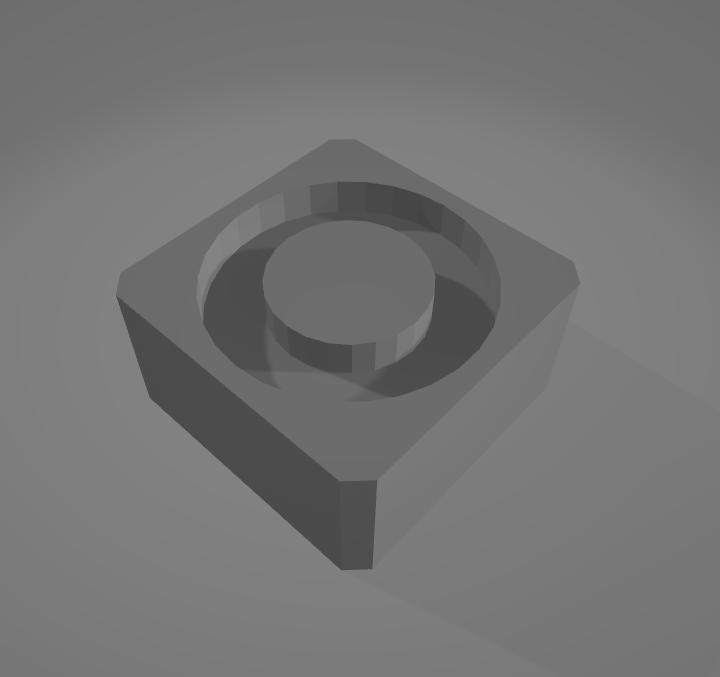
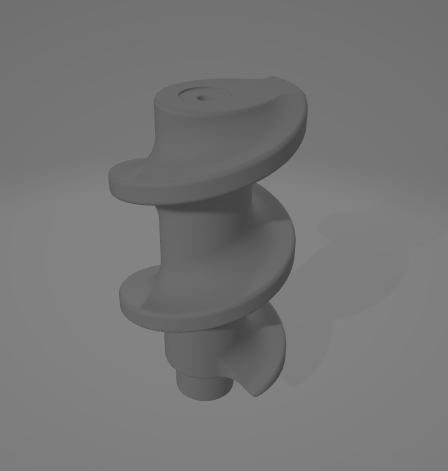

# Croquette
Croquette es un dispensador de comida para mascotas que va más allá de lo convencional. Su característica principal es la capacidad de conectarse a la aplicación de FTecnology, lo que permite a los dueños de mascotas dispensar comida de manera remota a través de Internet. Esto proporciona flexibilidad y comodidad tanto para los dueños de mascotas como para las propias mascotas.
## Features

- **Conexión Remota:** Croquette se conecta a la aplicación FTecnology, lo que permite a los usuarios dispensar comida de forma remota. Ya no es necesario estar físicamente presente para alimentar a tu mascota.

- **Programación de Alimentación:** Los usuarios pueden establecer horarios de alimentación regulares para sus mascotas a través de la aplicación. Croquette dispensará automáticamente la cantidad programada de comida en los momentos designados.

- **Monitoreo en Tiempo Real:** La aplicación proporciona información en tiempo real sobre cuándo se dispensó comida por última vez, cuánta comida queda en el dispensador y el consumo de comida de tu mascota en general.

## Archivos de Diseño de Croquette
En este repositorio, encontrarás los archivos de diseño de Croquette (El dispensador) en formato .blend y .stl

### **Croquette/designs.tls/allDesing.stl  Croquette/designs.tls/allDesing.blend**


Explicación de diseño 

- **Líneas Celeste:** Explican el movimiento para ensamblar el dispensador
- **Líneas Rojas:** Las partes del dispensador
- **Líneas Verdes:** Entrada y salida de comida
- **Líneas Azules:** Dimensión de la imagen

### **Dimensión en menos X (-x)**


### **Dimensión en X (x)**


### **Dimensión en Y (Y)**


### **Dimensión en menos Y (-Y)**


### **Costado de todo el diseño**

### **Case eléctrico**


### **Soporte y botones del case**


## Tech

Estos son todos los archivos .tls en el proyecto para imprimir

- **Croquette/designs.tls/Button_Ok.tls** Es el botón de OK 

- **Croquette/designs.tls/Button_Up.tls** Es el botón para subir o bajar selecciones

- **Croquette/designs.tls/Case_Cover_Leg.tls** Soporte de caja eléctrica (x4)


```
Nota: El archivo Case_Cover_Leg.tls se imprimirá 4 veces, ya que son 4 soportes para la caja (en cada esquina un soporte) 
```
- **Croquette/designs.tls/Extruder_P1.tls** Este es el case para el espiral

- **Croquette/designs.tls/Extruder_P2.tls** Esta pieza es donde entra la comida

- **Croquette/designs.tls/UNO+PW_Case.tls** Este es el case eléctrico

- **Croquette/designs.tls/UNO+PW_Case.tls** La tapadera del case eléctrico


- **Croquette/designs.tls/Tray.tls** EL plato donde se dispensara la comida


- **Croquette/designs.tls/Tray_Left.tls** Plato del lado izquierdo


- **Croquette/designs.tls/Tray_Right.tls** Plato del lado Derecho


```
Nota: Hay 3 archivos para el plato: Tray_left.tls, Tray_Right.tls & Tray.tls

Se imprimirá solo Tray.tls, ya que el de izquierda y derecha no son ensamblables
```

- **Croquette/designs.tls/LCD_Pin.tls** Pines para sostener la pantalla LCD (x3)

```
Nota: El archivo LCD_Pin.tls se imprimirá 3 veces, ya que son 3 soportes para la pantalla LCD
```

- **Croquette/designs.tls/Motor_plate.tls** Placa para sujetar el motor y hacer girar el espiral


- **Croquette/designs.tls/Support_Feeder.tls** Soporte para mantener la case del espiral (x2)

```
Nota: El archivo Support_Feeder.tls se imprimira 2 veces, ya que son 2 soportes para el case del espiral
```
- **Croquette/designs.tls/Wormgear.tls** Espiral normal (a imprimir)


- **Croquette/designs.tls/Wormgear_short_pitch.tls** Espiral con un espacio mas largo 


- **Croquette/designs.tls/Wormgear_long_pitch.tls** Espiral con un espacio mas corto 


```
Nota: Hay 3 archivos para el espiral: Wormgear.tls, Wormgear_short_pitch.tls & Wormgear_long_pitch.tls

Se imprimirá solamente uno, creería que el mas optimo es Wormgear.tls
```

### Resumen
- El archivo **Case_Cover_Leg.tls** se imprimirá 4 veces
- El archivo **Tray.tls** es el que se imprimirá 
- El archivo **LCD_Pin.tls** se imprimirá 3 veces
- El archivo **Support_Feeder.tls** se imprimirá 2 veces
- Por optimización, se imprimirá solamente el archivo **Wormgear.tls**


# Componentes electricos
- 1x Arduino Nano V3
- 1x Stepper Motor: 28BYJ-48; Driver: ULN2003A
- 1x Load Cell 1Kg with ADC HX711
- 1x LCD Display: LCD1602A
- 2x Tact button
- 1x Micro USB 1A 18650 Lithium Battery Charging Board
- 1x 18650 battery
- 1x Capacitor 330uF 35V 
- 2x M3x10 Screws (motor plate)
- 4x M4x10 Screws (case)
- 2x M4x15 Screws (load cell_tray)
- 2x M5x15 Screws (case_load cell)
- Cables